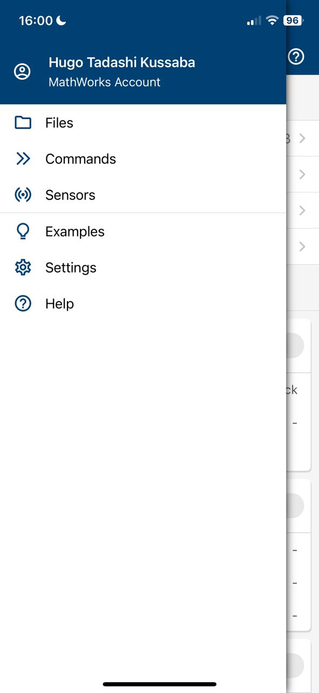
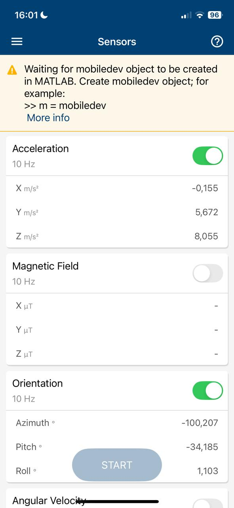

# ENE0068

### Filtros para estimação de ângulo a partir de acelerômetro e girômetro do celular

- `angle_using_accelerometer.m`: Estimação de ângulo apenas usando o acelerômetro
- `angle_using_gyrometer.m`: Estimação de ângulo apenas usando o girômetro
- `complementary_filter.m`: Filtros complementar para fusão sensorial de acelerômetro e giroscópio para estimação de ângulo

**Nota** : como diferentes celulares usam diferentes convenções para os eixos, pode ser necessário mudar algumas linhas de código

### Instruções:

1. Baixe o aplicativo [iOS](https://apps.apple.com/us/app/matlab-mobile/id370976661) ou [Android](https://play.google.com/store/apps/details?id=com.mathworks.matlabmobile&hl=en) do MATLAB Mobile
1. Abra a guia "Sensors" do aplicativo

1. Certifique que os controles relativos à Aceleração e Orientação estejam ligados

1. Rode o script `.m` no [MATLAB online](https://www.mathworks.com/products/matlab-online.html)
1. Aperte o botão `START` no aplicativo